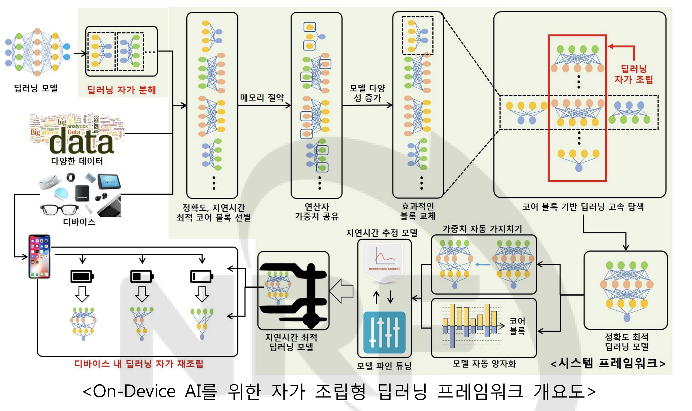

# Deep Learning Framework for On-Device AI

## Description

This project is divided into three parts (Classification, Detection, and Compression).

This project is funded by the National Research Foundation of Korea (NRF) grant funded by the Korea government(MSIT) (No.2020R1A2C101357511).
